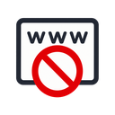

  

<h1 align="center">SimpleSiteBlock</h1>

Like the name suggests, SimpleSiteBlock is a simple site blocker for blocking distracting sites. It can use your own list of sites plus any popular blocklists you want to add. You can also set a password on the options page to help you stay accountable when temptations arise. There are no additional features like scheduled blocking or time limits. SimpleSiteBlock is for sites you want to block all the time.

To open the options page, click the SimpleSiteBlock icon in your browser's toolbar and select Options in the popup.
